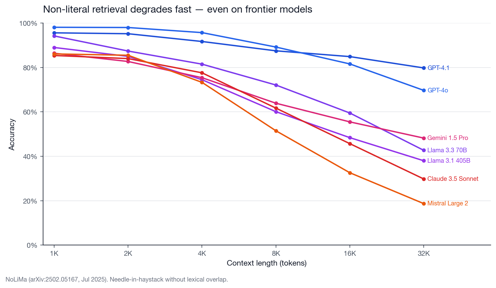
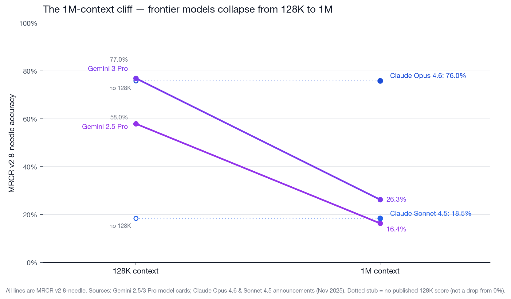
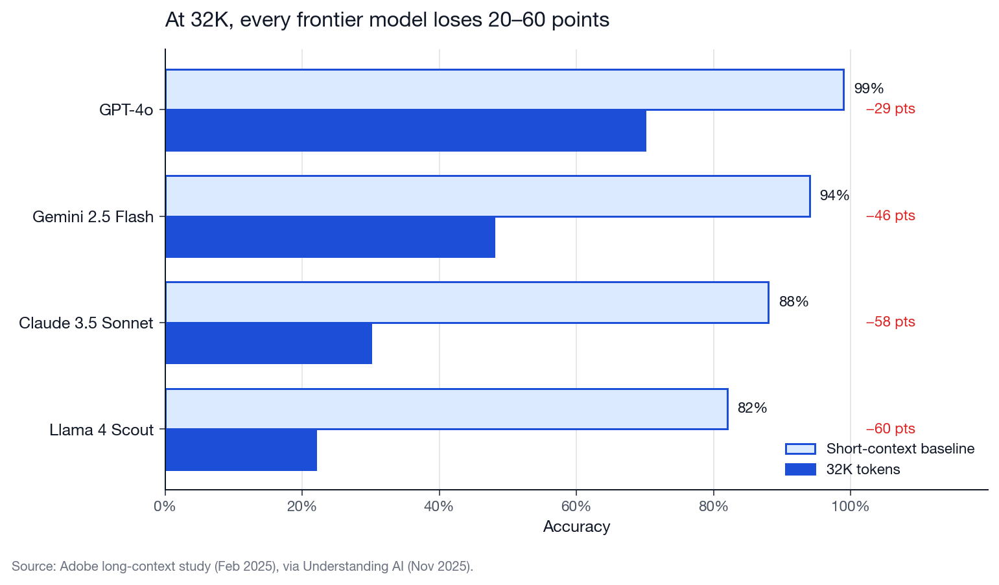

# Context Degradation: 2025–2026 Update

A secondary report complementing [`context_degradation.md`](context_degradation.md) with fresh data published in the last ~12 months. The original doc leans on RULER 2024 (GPT-4, Command-R 35B, Mixtral 8x7B, Mistral 7B). The cohort tested below — Claude Opus 4.6, GPT-4.1 / GPT-5, Gemini 2.5/3 Pro, Llama 4 Scout, Qwen3 — shows two things at once: the ceiling on trivial retrieval has moved up by roughly an order of magnitude, *and* the old degradation pattern is intact the moment you stop testing with pure string-match retrieval.

## Figure candidates

Three alternative figures for the slide deck — pick whichever fits the rhetorical frame of the talk. All three are generated from [`assets/gen_context_rot_figures.py`](assets/gen_context_rot_figures.py).

### Option A — Line chart (NoLiMa, 1K → 32K)



*Seven models, accuracy drops sharply once lexical overlap is removed. Closest visual continuity with the 2024 RULER chart; best for "same shape, new data" framing.*

### Option B — Slopegraph (MRCR v2, 128K → 1M)



*Frontier models at the 1M cliff. Claude Opus 4.6 is the single 1M-only point (no 128K published); Claude Sonnet 4.5 likewise. Best for "don't trust the 1M window" framing.*

### Option C — Paired bars (Adobe study, short vs 32K)



*Four models, −29 to −60 point drops between short baseline and 32K. Simplest, highest-density, works at the back of the room. Best for "every model, every time" framing.*

---

## Primary data — ready for charting

### Table 1 — NoLiMa (arXiv:2502.05167, ICML 2025, leaderboard updated Jul 2025)

Needle-in-a-haystack where the question and the needle share **minimal lexical overlap**, forcing latent/associative retrieval rather than attention-over-string-match. "Effective length" = longest context at which the model keeps ≥85% of its short-context base score.

| Model              | Claimed | Effective (≥85%) | Base  | 1K   | 2K   | 4K   | 8K   | 16K  | 32K  |
|--------------------|---------|------------------|-------|------|------|------|------|------|------|
| GPT-4.1            | 1M      | 16K              | 97.0  | 95.6 | 95.2 | 91.7 | 87.5 | 84.9 | 79.8 |
| GPT-4o             | 128K    | 8K               | 99.3  | 98.1 | 98.0 | 95.7 | 89.2 | 81.6 | 69.7 |
| Llama 3.3 70B      | 128K    | 2K               | 97.3  | 94.2 | 87.4 | 81.5 | 72.1 | 59.5 | 42.7 |
| Llama 3.1 405B     | 128K    | 2K               | 94.7  | 89.0 | 85.0 | 74.5 | 60.1 | 48.4 | 38.0 |
| Gemini 1.5 Pro     | 2M      | 2K               | 92.6  | 86.4 | 82.7 | 75.4 | 63.9 | 55.5 | 48.2 |
| Claude 3.5 Sonnet  | 200K    | 4K               | 87.6  | 85.4 | 84.0 | 77.6 | 61.7 | 45.7 | 29.8 |
| Mistral Large 2    | 128K    | 2K               | 87.9  | 86.1 | 85.5 | 73.3 | 51.5 | 32.6 | 18.7 |

Source: [NoLiMa GitHub README](https://github.com/adobe-research/NoLiMa), [paper](https://arxiv.org/abs/2502.05167).

### Table 2 — MRCR v2 8-needle (vendor-reported)

The one benchmark where Anthropic, OpenAI, and Google all publish head-to-head numbers with comparable methodology, at comparable depths.

| Model              | 128K (avg) | 1M (pointwise) | Source |
|--------------------|------------|----------------|--------|
| Claude Opus 4.6    | —          | **76.0%**      | [Claude Opus 4.6 announcement, Nov 2025](https://www.anthropic.com/news/claude-opus-4-6) |
| Gemini 3 Pro       | 77.0%      | 26.3%          | [Gemini 3 Pro model evaluation, Nov 2025](https://storage.googleapis.com/deepmind-media/gemini/gemini_3_pro_model_evaluation.pdf) |
| Gemini 2.5 Pro     | 58.0%      | 16.4%          | [Gemini 2.5 Pro model card, Jun 2025](https://storage.googleapis.com/model-cards/documents/gemini-2.5-pro.pdf) |
| Claude Sonnet 4.5  | —          | 18.5%          | [Claude Opus 4.6 announcement, Nov 2025](https://www.anthropic.com/news/claude-opus-4-6) |
| GPT-4.1 (2-needle) | 57.2%      | ~46%           | [GPT-4.1 blog, Apr 2025](https://openai.com/index/gpt-4-1/) |

Caveats:
- GPT-4.1 row is 2-needle MRCR (the only public-chart data); all others are 8-needle MRCR v2. Do not treat the 2-needle and 8-needle numbers as directly comparable — 2-needle is a strictly easier variant.
- Gemini 2.5 Pro's tech report quotes **91.5% on MRCR v1 at 128K** vs the **58.0% v2** here. The 33-point gap between v1 and v2 on the same model at the same length is the single clearest example of "which MRCR" mattering enormously. Cite with care.

### Table 3 — Adobe long-context study (Feb 2025)

Accuracy at 32K vs each model's own short-context baseline. Via [Understanding AI, Nov 2025](https://www.understandingai.org/p/context-rot-the-emerging-challenge) (primary Adobe paper not re-fetched — flag for verification before slide use).

| Model              | Short baseline | 32K  | Drop  |
|--------------------|----------------|------|-------|
| GPT-4o             | 99%            | 70%  | −29   |
| Gemini 2.5 Flash   | 94%            | 48%  | −46   |
| Claude 3.5 Sonnet  | 88%            | 30%  | −58   |
| Llama 4 Scout      | 82%            | 22%  | −60   |

### Table 4 — Other 2025 benchmarks (worth citing, not charted here)

| Benchmark | What it measures | Headline finding | Source |
|-----------|------------------|------------------|--------|
| **Context Rot** (Chroma, Jul 2025) | Extended NIAH, LongMemEval, repeated-words replication at 25–10,000 tokens, across 18 models | **All 18 models degrade with length, even on the trivially simple replication task.** Focused ~300-token LongMemEval prompts beat 113k-token ones on every model family. | [research.trychroma.com/context-rot](https://research.trychroma.com/context-rot) |
| **HELMET** (ICLR 2025) | 7 task families (RAG, citation generation, reranking, many-shot ICL, long-doc QA, summarization, synthetic recall) at {8K, 16K, 32K, 64K, 128K}, 59 LCLMs | **Synthetic NIAH does not predict downstream long-context performance.** Gap between closed-source and open-source is ~30–40 points on citation generation and reranking, much smaller on recall. | [princeton-nlp.github.io/HELMET](https://princeton-nlp.github.io/HELMET/) |
| **LongBench v2** (ACL 2025) | 503 multiple-choice questions, contexts 8K–2M words | Human baseline 53.7%; leaderboard average ~55%. Reasoning agents (Gemini Deep Think, Qwen3.5) score 63–94 on subsets but raw long-context QA is much lower. | [longbench2.github.io](https://longbench2.github.io/) |
| **Fiction.LiveBench** (rolling, Jul 2025 snapshot) | 36 questions × 30 fiction stories rendered at 0–192K tokens; deep-narrative state tracking | Gemini 2.5/3 Pro, Grok 4 lead above 120K; most frontier models drop from short-context baseline starting around 32K. | [fiction.live…oQdzQvKHw8JyXbN87](https://fiction.live/stories/Fiction-liveBench-July-25-2025/oQdzQvKHw8JyXbN87) |
| **SWE-Bench Pro** (Scale, 2025) | Harder long-horizon coding | **Best agents resolve ≤23.3% public / ≤17.8% commercial** vs 70%+ on SWE-bench Verified. | [OpenReview 9R2iUHhVfr](https://openreview.net/forum?id=9R2iUHhVfr) |
| **"SWE-Bench Illusion"** (arXiv 2506.12286, Jun 2025) | File-path identification with and without repo context | o3 hits **76% file-path ID with no repo context**; drops to ~53% on out-of-distribution repos. Suggests Verified scores reflect memorization more than context handling. | [arXiv:2506.12286](https://arxiv.org/abs/2506.12286) |

---

## What changed vs the 2024 figure

1. **The ceiling moved up on trivial retrieval.** Classic needle-in-a-haystack is effectively saturated at frontier scale — OpenAI explicitly notes GPT-4.1 scores 100% across all lengths. Meta's Llama 4 Scout ships with "perfect NIAH at 10M." Those numbers are real but no longer discriminative.
2. **The drop still happens once the test is harder.** NoLiMa (blocks lexical overlap) has GPT-4.1 falling from 97.0 → 79.8 by 32K and GPT-4o's effective context bottoming at 8K. On 8-needle MRCR v2 at 1M, Claude Sonnet 4.5 scores 18.5% and Gemini 3 Pro 26.3%. The shape of the 2024 chart is intact; the x-axis has just shifted right by ~8×.
3. **Retrieval ≠ aggregation ≠ coding.** HELMET's headline — synthetic NIAH does not predict downstream long-context performance — is the single most important reframing. The 2024 figure was criticized for conflating these. The 2026 replacement should pick one axis and be explicit about it: the proposed Option A shows non-literal retrieval; Option B shows multi-needle coreference; Option C shows mixed long-context QA.
4. **Vendor self-reports vs independent evaluations are diverging.**
   - Llama 4 Scout: 10M "perfect NIAH" from Meta, community re-evaluations collapsed above ~256K. No multi-needle or MRCR published.
   - Gemini 2.5 Pro: 91.5% MRCR v1 @ 128K (tech report, marketed number) vs 58.0% MRCR v2 @ 128K (model card). Same model, same length, 33-point gap.
   - Anthropic: launched Sonnet 4 1M beta in Aug 2025 with zero long-context benchmark numbers. The Opus 4.6 page (Nov 2025) later confirmed Sonnet 4.5 scores only 18.5% on 1M MRCR v2.
   - DeepSeek-V3 and Qwen3: advertise 128K/256K but publish only classic NIAH or nothing.

---

## Why this matters for coding agents

Practitioner + lab evidence on how long-context decay plays out specifically inside agent/coding workflows:

- **Harness > model.** LangChain's deep-agent jumped from outside the top-30 to top-5 on Terminal Bench 2.0 (**52.8% → 66.5%, +13.7 points**) without changing the model — purely through context offload + compression. ([LangChain, Jan 2026](https://www.langchain.com/blog/context-management-for-deepagents))
- **Anthropic's Claude Code pattern is just-in-time retrieval.** Subagents return **1,000–2,000 token summaries** rather than full traces; CLAUDE.md loaded upfront, grep/glob for everything else. This is the lab's direct endorsement of subagents-with-minimal-context over monolithic sessions. ([Anthropic, Sep 2025](https://www.anthropic.com/engineering/effective-context-engineering-for-ai-agents))
- **Multi-agent orchestration can be +90.2% — or −X%, depending.** Anthropic reports orchestrator + parallel subagents beating single-agent Opus 4 by 90.2% on research evals, at 15× token cost. ([Anthropic, Jun 2025](https://www.anthropic.com/engineering/multi-agent-research-system)) Cognition's counter-position: multi-agent breaks when implicit design decisions must be shared across subagents. ([Cognition, Jun 2025](https://cognition.ai/blog/dont-build-multi-agents)) Both correct — the design rule is "subagents win when subtasks can be tightly specified and results compressed."
- **SWE-bench Verified overstates long-context coding ability.** SWE-Bench Pro (harder tasks) caps frontier agents at ≤23% resolution. The "SWE-Bench Illusion" paper shows o3 achieves 76% file-path ID with no repo context at all — Verified scores reflect memorization more than real context handling.
- **Compaction is load-bearing but fragile.** Anthropic explicitly warns compaction quality is weakest precisely when the context is already rotten — so summarize early, not late. ([Anthropic harness post, Nov 2025](https://www.anthropic.com/engineering/effective-harnesses-for-long-running-agents))

---

## Quotes worth pulling for slides

> "Like humans, who have limited working memory capacity, LLMs have an 'attention budget' that depletes with every new token introduced."
> — Anthropic, *[Effective context engineering for AI agents](https://www.anthropic.com/engineering/effective-context-engineering-for-ai-agents)* (Sep 2025)

> "Actions carry implicit decisions, and conflicting decisions carry bad results."
> — Walden Yan, Cognition, *[Don't Build Multi-Agents](https://cognition.ai/blog/dont-build-multi-agents)* (Jun 2025)

> "Context is not free. Every token influences the model's behavior, for better or worse."
> — Simon Willison, *[How to Fix Your Context](https://simonwillison.net/2025/Jun/29/how-to-fix-your-context/)* (Jun 2025)

> "Models do not use their context uniformly; performance grows increasingly unreliable as input length grows."
> — Chroma, *[Context Rot](https://research.trychroma.com/context-rot)* (Jul 2025)

> "A multi-agent system with Claude Opus 4 and Sonnet 4 subagents outperformed single-agent Opus 4 by 90.2% on our internal research eval."
> — Anthropic, *[How we built our multi-agent research system](https://www.anthropic.com/engineering/multi-agent-research-system)* (Jun 2025)

---

## Verification notes

- NoLiMa, MRCR (Gemini / Claude Opus 4.6 / GPT-4.1), Chroma Context Rot, HELMET, LongBench v2, SWE-Bench Pro, SWE-Bench Illusion: all verified against primary sources (linked inline).
- **Adobe Feb 2025 numbers** (used in Option C / Table 3) are cited via [Understanding AI, Nov 2025](https://www.understandingai.org/p/context-rot-the-emerging-challenge). The primary Adobe paper was not re-fetched in this round — **verify before public use.**
- Fiction.LiveBench and BABILong leaderboards render client-side; per-cell numbers not extractable via WebFetch. For exact values, open the live leaderboard page.
- "Lost in the Middle" (Liu et al. 2023) is >12 months old; cited in the original doc as the historical anchor.

## Regenerating the figures

```bash
uv run --with matplotlib --with numpy \
  python docs/assets/gen_context_rot_figures.py
```

Outputs: `docs/assets/context-rot-2026-v{1,2,3}-*.png`.
