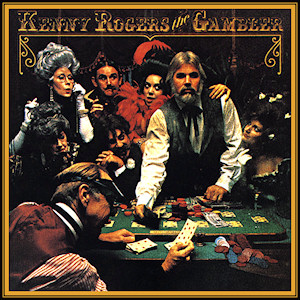

# Effective Claude Code

Patterns from building a platform in 5 days

**Husain Al-Mohssen**

<!-- _footer: "" -->
<!-- _paginate: false -->

---

## The uncertainty is the point


- No one has this figured out. Not us, not anyone.
- The imperfection is permanent, not temporary.
- Our job: build patterns anyway.

A field report, not a playbook.

---

## AI can hurt you


METR 2025 RCT: 16 experienced OSS developers

- **19% slower** with AI
- *Believed* they were **20% faster**
- **39-point** perception gap

Feb 2026 followup (57 devs): still no significant speedup.

Not anti-AI. Anti-**naive** adoption.

---

## So what does work?

Not tips and tricks. **Structural patterns.**

1. How the developer's role changes
2. How to manage agent context and execution
3. How to verify agent output
4. What failed

---

## It's all meta-programming


You stop writing code. You start designing **agent workflows**.

1. **Design** the workflow
2. **Write** the spec
3. **Review** the output
4. **Iterate** on the spec, not the code

*"dude have an agent do the work don't do it yourself"*

---

## Meta-programming in practice

```
Day 1: "Claude, write a function that..."
Day 3: "Start 3 agents to each implement this spec,
        then start 2 auditors to cross-review"
Day 5: "12-agent, 5-phase pipeline with parallelism
        rules, gates, and selection criteria"
```

From **using AI to help me code** to **designing agent systems that produce code**.

44% of activity was still direct coding -- you never fully stop. The leverage is in the orchestration.

---

## Know your execution modes


| Mode | What it is | When |
|------|-----------|------|
| **Single session** | One conversation, you drive | Simple tasks |
| **Subagents** | Spawned child processes | Parallel work |
| **Agent teams** | Shared task list + messaging | Large efforts (experimental) |

Most patterns in this talk use **subagents**.

---

## Context is everything


| Model | 4K | 128K | Drop |
|-------|-----|------|------|
| GPT-4 | 96.6% | 81.2% | -15 pts |
| Mixtral | 94.9% | 44.5% | -50 pts |
| Mistral 7B | 93.6% | 13.8% | -80 pts |

**Agent design = context design.**

Each subagent gets the **minimum context** for its task. Fresh agent with 4K of focus beats a bloated session at 100K.

---

## Testability determines success

Anthropic C compiler case study:

| Metric | Value |
|--------|-------|
| Agents | 16 in parallel |
| Output | ~100K lines of Rust |
| Cost | ~$20K |
| Pass rate | **99%** GCC torture tests |

Carlini: *"Most of my effort went into designing the tests, the environment, the feedback."*

---

## The testability spectrum

| Domain | Testability | Agent effectiveness |
|--------|-----------|-------------------|
| Compilers | Binary correct/wrong | Excellent |
| Math proofs | Formal verification | Excellent |
| SWE-bench | Test suites | Good but incomplete |
| Web UI | Selenium/visual | Moderate |
| Business logic | Subjective | Weak without specs |

The agent's capability is the ceiling. **The test infrastructure is the floor.**

---

## Selenium QA as a gate


Multi-agent changes break the UI in ways unit tests miss.

- Caught avatar mismatch after multi-agent refactoring
- Caught stale refs, React state sync bugs
- Pass/fail tables enabled **parallel fix delegation**

Separated 7 phantom Chrome crashes from 2 real bugs.

---

## Verification by explanation

Force agents to **show their understanding**.

| Technique | What it catches |
|-----------|----------------|
| Claim-by-claim table | Factual errors in your own descriptions |
| Comparison matrix | Hidden disagreements between agents |
| Accuracy score | Calibrated confidence before sharing |
| **Diagram of understanding** | Misunderstandings BEFORE they become bugs |

The diagram IS the verification. If the agent's picture doesn't match yours, its code won't either.

---

## What to say (and not say)

| DO | DON'T |
|----|-------|
| "Start 3 agents to each implement this spec" | "Help me write this function" |
| "All work by agents, you only supervise" | Let Claude do the work itself |
| "Have agent A audit agent B's output" | Ask one agent to check its own work |
| Give each agent a role and perspective | Dump everything into one session |

Escalation: "start an agent" -> "don't do this yourself" -> "ALL agents not you" -> "dude have an agent do it"

---

## What failed

- **Full autonomy is a myth** -- human intervention was constant
  - *"THERE IS NO WAY THEY DID A GREAT JOB"*
  - Rate limits killed all 3 builders in one round
- **Specs don't enforce themselves** -- 5/6 modules violated the frozen spec
- **Same-model auditors are lenient** -- they share blind spots
- **Quorum rules** -- never triggered, untested

---

## Know when to hold 'em



> *"You got to know when to hold 'em, know when to fold 'em"*
> -- Kenny Rogers

The new killer SWE skill: **knowing when to review and when to trust.**

| Trust it | Review it | Rewrite it |
|----------|----------|------------|
| Boilerplate, scaffolding | Business logic, API contracts | Security-critical code |
| Tests pass + matches spec | Novel algorithm, edge cases | Anything you can't test |
| Read-only research | External-facing output | Core architecture decisions |

---

## Key takeaways

1. **Naive AI makes experienced devs slower** (METR 2025)
2. Your job is **meta-programming** -- design agent workflows, not code
3. **Context management** is the core skill -- smaller = more accurate
4. **Testability determines success** -- invest in test infrastructure first
5. **Force agents to show understanding** -- the diagram is the verification
6. **Know when to trust, when to review** -- that's engineering judgment now

---

## Questions & discussion

**Husain Al-Mohssen**

<!-- _footer: "" -->
<!-- _paginate: false -->

---

<!-- _class: lead -->

# Appendix

---

## Appendix: Frozen specs prevent drift


Git-tagged, immutable specs as single source of truth.

- 16 stories frozen with `git tag -a e2e-stories-v1`
- 4 agents audited ~30 files, only 3 minor fixes
- Build and demo agents read from same frozen source

**Limitation:** Prevents spec-to-spec drift but NOT spec-to-code drift. 5/6 modules violated SKILL.md. Need active enforcement.

---

## Appendix: Build -> Test -> Audit -> Select


1. **Build** (parallel): N agents implement same spec
2. **Test** (sequential): automated suite against each
3. **Audit** (parallel): cross-review survivors
4. **Select**: pick the best, or none

Cross-auditors caught 19 real issues. Cross-audit (builder A reviews builder C) beat separate auditor agents.

---

## Appendix: Dedup poisons tests


1. API call fails
2. Response gets **cached**
3. Subsequent runs replay the **cached failure**
4. Tests look broken, API is fine

9 debugging steps before finding root cause. Hit twice. Blocked flagship feature.

**Fix:** Never cache errors. TTL-based expiry. No caching in test envs.

---

## Appendix: Three-agent fact-checking


```
Researcher --> Auditor --> Summarizer
```

- 4/27 claims had errors (15% caught)
- Each agent sees only predecessor's output
- 3x latency (6-15 min vs 2-5 min)

**Use when:** sharing externally, making decisions.
**Skip when:** exploring, speed > accuracy.

Give auditors a **specific perspective** for better coverage.

---

## Appendix: Ask for alternatives

Before committing to any approach:

*"Give me 3 ways to do this with trade-offs for each"*

- Forces the model to explore the solution space, not just its first instinct
- You pick from a menu instead of accepting a default
- Works for architecture, API design, error handling, naming

Don't accept the first answer. Make the model compete with itself.

---

## Appendix: Use the advisor sidekick

```bash
./advice.sh
```

Run it in a **separate terminal** alongside your Claude Code session.

- Coaching TUI that knows all the best practices in this talk
- Advises on prompting, agent orchestration, context management, verification
- **Never writes code or touches your files** — only advises
- Gets smarter as you add docs to `docs/`

Ask it things like:
- *"I have a 20-file refactor. How should I structure this?"*
- *"My session is getting long. What should I do?"*
- *"Should I use subagents here?"*

`github.com/mohsseha/effective_claude_code`

---

## Appendix: YOLO mode

```bash
claude --dangerously-skip-permissions
```

| Use YOLO when | Don't when |
|--------------|-----------|
| Throwaway prototype | Production code |
| Well-scoped task | Open-ended work |
| You're watching | You're away |
| Git is your safety net | Uncommitted work |

Commit first. Branch, not main. Keep it narrow. `git diff` after.

<!-- _footer: "" -->
